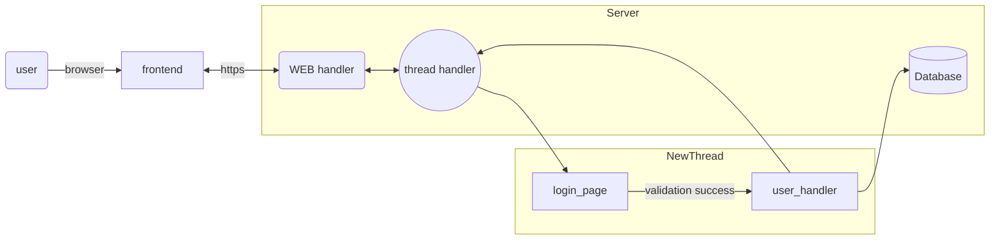

```mermaid
flowchart LR
    user(user) -- browser --> page[frontend]
    page <-- https --> WH
    subgraph NewThread
        login_page -- validation success --> user_handler
    end
    subgraph Server
        thread_handler((thread handler)) --> login_page
        user_handler --> DB[(Database)]
        WH(WEB handler) <--> thread_handler
    end
    user_handler -->thread_handler
```