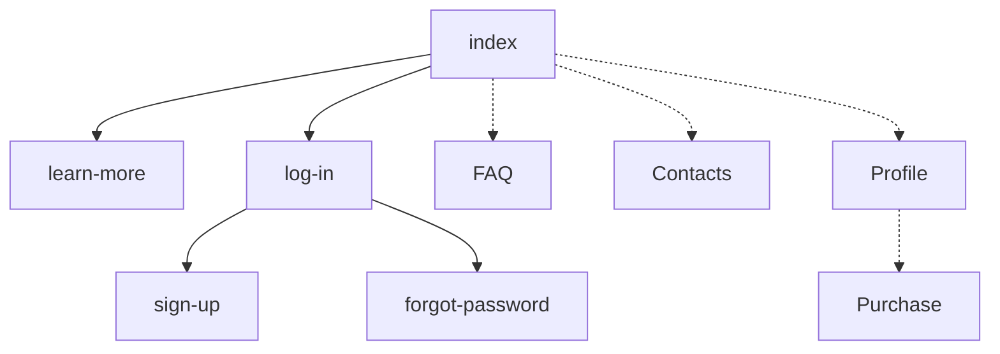
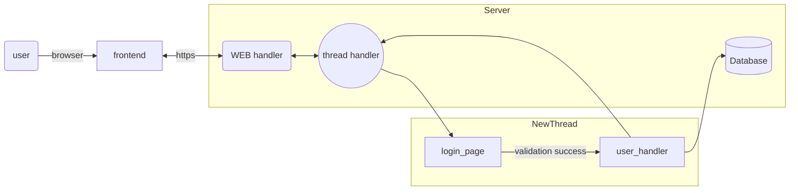

# MyVPN WebService

This is a simple web service to subscribe to my VPN service.

## Links

## Site structure

```mermaid
graph TB
    MP[index] --> LM[learn-more]
    MP --> LI[log-in] --> SU[sign-up]
    LI --> FP[forgot-password]
    MP -.-> D[FAQ]
    MP -.-> E[Contacts]
    MP -.-> P[Profile]
    P -.-> Purchase
```

## Architecture (*in future*)

```mermaid
flowchart LR
    user(user) -- browser --> page[frontend]
    page <-- https --> WH
    subgraph NewThread
        login_page -- validation success --> user_handler
    end
    subgraph Server
        thread_handler((thread handler)) --> login_page
        user_handler --> DB[(Database)]
        WH(WEB handler) <--> thread_handler
    end
    user_handler -->thread_handler
```